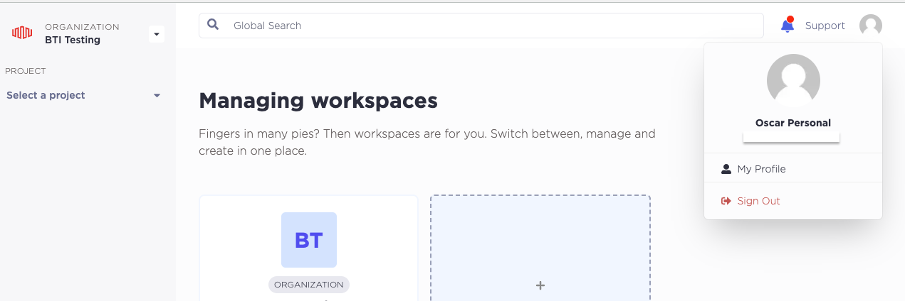
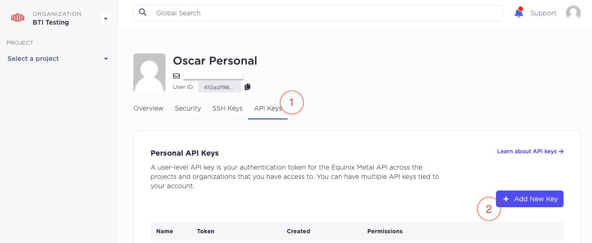

# Part 1: Account and API Key Setup

To run this workshop you will need access to an Equinix Metal Account or create a new one following step 1 below.

> **_Note:_**  You are responsible for the cost of resources created in your Equinix Metal account while running this workshop.

## Pre-requisites

The following tools will be needed on your local development environment where you will be running most of the commands in this guide:

* A Unix-like environment (Linux, OSX, [Windows WSL](https://docs.microsoft.com/en-us/windows/wsl/install))
* [git](https://git-scm.com/download/) (v2.0.0+)
* [metal-cli](https://deploy.equinix.com/labs/metal-cli/) (v0.9.0+)
* [terraform](https://deploy.equinix.com/labs/terraform-on-equinix-workshop/) (v1.0.0+)

## Steps

### 1. Create an Equinix Metal account

If you have never used Equinix Metal before, don't worry, you just need 2 minutes to [sign-up and create your first organization](https://console.equinix.com/sign-up). If you have any doubt you can watch our [Getting Started with Equinix Metal](https://www.youtube.com/watch?v=5Ax6fKBeg2U&t=153s) video.

### 2. Create an API key

API keys in Metal can be tied to your user or to a single project. For this workshop we will need a user-level API key.

> **_Note:_** Project API keys do not have access to the entirety of the API; some endpoints can only be used by personal API keys.

To create a new user API key, access your user Profile in the Equinix Metal console, click on the **User Icon**, and click **My Profile**.



- Select the `API Keys` tab.
- Click on `+ Add New Key`.
- Create a new key with `Read/Write` permissions.



### 3. Install and Configure Metal CLI

Once you are familiar with the console you may feel more comfortable managing your Equinix Metal resources with the command-line interface tool [Metal-cli](https://github.com/equinix/metal-cli).

You only need to download a binary to start enjoying Metal-cli, but you may want to check out the different [installation options](https://github.com/equinix/metal-cli/#installation).

Once installed you need to configure your credentials. To do this, execute `metal init` and provide the requested information.

Expected output:

```shell
$ metal init

Equinix Metal API Tokens can be obtained through the portal at https://console.equinix.com/.
See https://metal.equinix.com/developers/docs/accounts/users/ for more details.

Token (hidden): 
Organization ID [e83e4455-e7bf-4a2f-95cf-653b56db1939]: 
Project ID []: 

Writing /Users/Username/.config/equinix/metal.yaml
```

### 5. Install Git and Terraform

There are many ways to install `git` and `terraform` locally. However, we will use a package manager, [`homebrew`](https://brew.sh/), as an example.

```shell
$ brew install git
```

```shell
$ brew install terraform
```

### 4. Verify

```shell
$ metal organization get

+--------------------------------------+------------------------------+----------------------+
|                  ID                  |             NAME             |       CREATED        |
+--------------------------------------+------------------------------+----------------------+
| e83e4455-e7bf-4a2f-95cf-653b56db1939 | Equinix Metal Kubernetes POC | 2023-01-01T00:00:00Z |
+--------------------------------------+------------------------------+----------------------+

$ git -v
git version 2.40.0

$ terraform -v
Terraform v1.5.6
on darwin_arm64
```

## Discussion

Before proceeding to the next part let's take a few minutes to discuss what we did. Here are some questions to start the discussion.

* Can we create API keys without manually using the portal?
