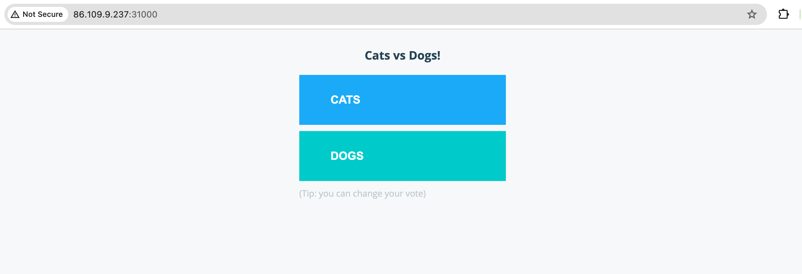
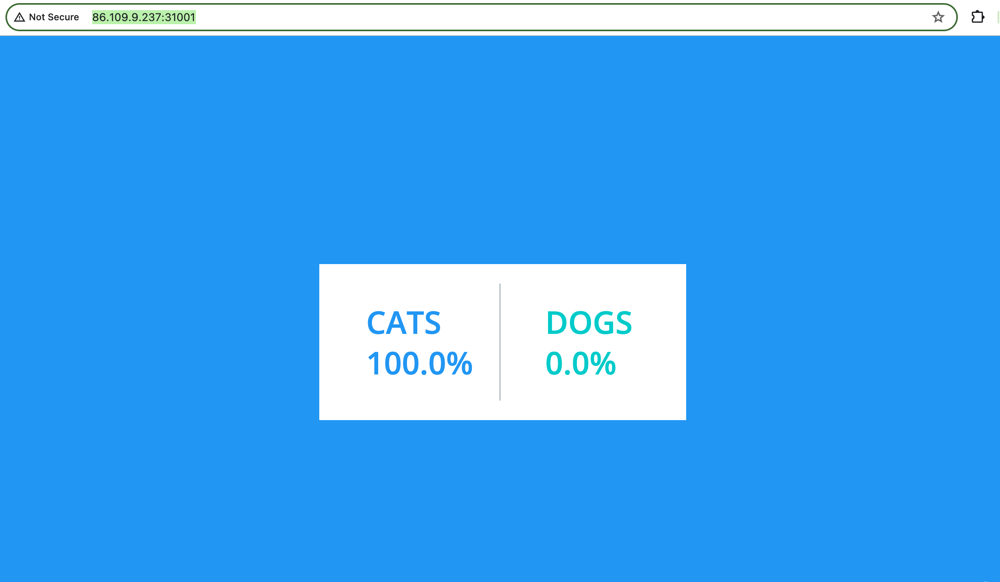

<!-- See https://squidfunk.github.io/mkdocs-material/reference/ -->
# Part 3: Deploying a Demo App

We have a Kubernetes Cluster up and running. Let's deploy a small sample app into the cluster provisioned in Part 2 of the workshop. The following steps require that you have a basic understanding of how to run applications on Kubernetes. For further info, please read [`Run Applications` Kubernetes Documentation](https://kubernetes.io/docs/tasks/run-application/).

The steps below will guide you to deploy a sample app onto a Kubernetes cluster.

## Steps

### 1. Clone the Kubernetes examples repo

In order to deploy an app into Kubernetes, we are going to need the app's deployment manifest files. For demonstration, we are going to clone the [example-voting-app](https://github.com/dockersamples/example-voting-app)

```shell
$ git clone https://github.com/dockersamples/example-voting-app.git
```

### 2. Deploy the sample app

For demonstation, we are going to the deploy the [`example-voting-app`](https://github.com/dockersamples/example-voting-app). This solution uses Python, Node.js, .NET, with Redis for messaging and Postgres for storage

Let's deploy the app onto Kubernetes:

```shell
$ cd example-voting-app
$ kubectl create -f k8s-specifications/
service/db created
deployment.apps/redis created
service/redis created
deployment.apps/result created
service/result created
deployment.apps/vote created
service/vote created
deployment.apps/worker created
```

### 3. Verify the deployment

Now that we have deployed the sample, let's access the frontend of the `vote` and `result` services.

```shell
$ kubectl get services
NAME         TYPE        CLUSTER-IP       EXTERNAL-IP   PORT(S)          AGE
db           ClusterIP   10.106.128.127   <none>        5432/TCP         15m
kubernetes   ClusterIP   10.96.0.1        <none>        443/TCP          56m
redis        ClusterIP   10.100.238.46    <none>        6379/TCP         15m
result       NodePort    10.108.141.185   <none>        5001:31001/TCP   15m
vote         NodePort    10.102.54.144    <none>        5000:31000/TCP   15m
```

The `result` service is exposed on port `31001` and the `vote` service is exposed on port `31000` from the service definition shown above. Since we know that the cluster IP is `86.109.9.237` from Part 2, let's insert `http://86.109.9.237:31000/` into a Web browser to check out the `vote` Web interface and `http://86.109.9.237:31001/` to check out the `result` Web interface of the sample app.

On `http://86.109.9.237:31000/` URL, we should see:


Click on the `Cats` button to cast a vote for cats.

On `http://86.109.9.237:31001/` URL, we should see:


## Discussion

Let's take a few minutes to discuss what we did. Here are some questions to start the discussion.

* How is an application deployed on a Kubernetes cluster?
* How do we verify that the application services are running ok on a Kubernetes cluster?